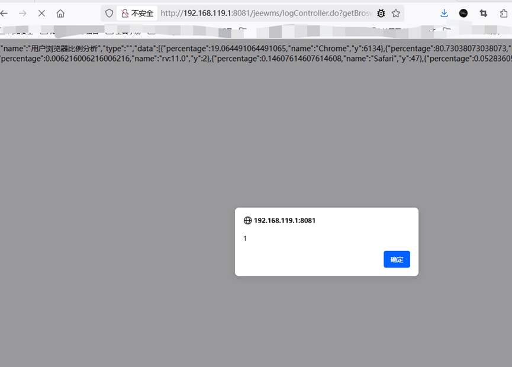
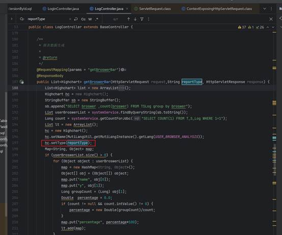
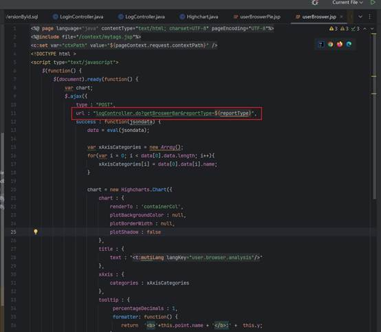

### Software:

https://gitee.com/erzhongxmu/JEEWMS


### Description:

CVE-2025-55834: The reportType parameter of the JeeWMS logController.do interface has an XSS vulnerability. Cross Site Scripting vulnerability in JeeWMS v.3.7 and before allows a remote attacker to obtain sensitive information via the logController.do component.

### Affected Versions:

JeeWMS - <=3.7


### Proof of Concept:

```
GET /jeewms/logController.do?getBroswerBar&reportType=%3Cscript%3Ealert%281%29%3C%2fscript%3E HTTP/1.1
```




### Code Analysis:


Start at line 185 of src/main/java/org/jeecgframework/web/system/controller/core/LogController.java:



`reportType` is set to the `type` property of the `Highchart` object. If the front-end JS code is directly concatenated to HTML/JS, without any escaping or whitelist checking, it will cause xss. Navigate to the front-end js code, src/main/webapp/webpage/system/log/userBroswer.jsp:



`${reportType}` is inserted directly into JS with no other processing.


### Discoverer:
RrEeSeEeTt

 
